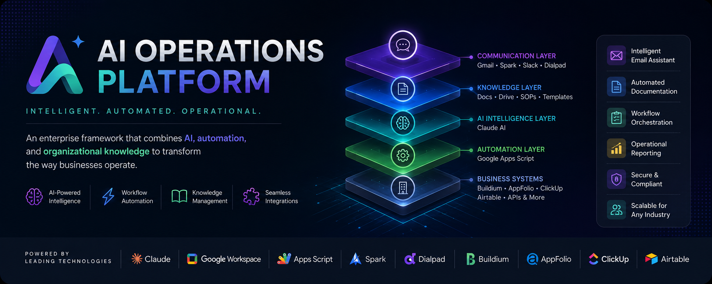

<p align="center">
  
</p>

<p align="center">


</p>

---------

> **An enterprise framework that transforms organizational knowledge into intelligent business operations powered by AI.**

<p align="center">
<a href="#-overview">🏠 Overview</a> •
<a href="#-platform-architecture">🏗️ Architecture</a> •
<a href="#-features">✨ Features</a> •
<a href="#-documentation">📚 Documentation</a> •
<a href="#-roadmap">🛣️ Roadmap</a>

</p>

---

# 🚀 Transform Business Operations with AI

The **AI Operations Platform (AIOP)** is an enterprise framework for building intelligent business operations powered by **Claude AI**, **Google Apps Script**, **Google Workspace**, and modern API integrations.

Unlike traditional workflow automation, AIOP combines:

- 🧠 Artificial Intelligence
- ⚡ Workflow Automation
- 📚 Organizational Knowledge
- 🔗 Business System Integrations

into one unified operational platform.

Instead of employees searching through documents, SOPs, and multiple applications, AIOP understands how the business works and helps employees execute work faster, more consistently, and with greater confidence.

---

## ⚡ Quick Start

```text
AI Operations Platform

↓

Knowledge

↓

Claude AI

↓

Google Apps Script

↓

Business Systems

↓

Automation
```

**Current Status**

- ✅ Planning
- ✅ Vision
- 🚧 Architecture
- 🚧 System Design
- ⏳ Implementation

---

# 🎯 Vision

Create an intelligent digital coworker for every organization.

AIOP transforms company knowledge into an AI-powered operational platform capable of assisting employees, orchestrating workflows, and preserving institutional knowledge across the entire business.

---

## 🌟 Platform Capabilities

<table>
<tr>
<td width="25%" align="center">

### 🧠 AI Intelligence

Reasoning

Classification

Decision Support

Summarization

</td>

<td width="25%" align="center">

### ⚡ Automation

Google Apps Script

Triggers

Workflows

API Orchestration

</td>

<td width="25%" align="center">

### 📚 Knowledge

SOP Search

Policies

Templates

Documentation

</td>

<td width="25%" align="center">

### 🔗 Integrations

Google Workspace

Spark

Buildium

AppFolio

Slack

</td>
</tr>
</table>

---

## 🚧 Current Implementation

The first implementation of AIOP focuses on **HOA and Residential Property Management**.

### Included

- AI Knowledge Assistant
- Email Automation
- SOP Intelligence
- Document Generation
- Workflow Automation
- Google Workspace Integration

### Planned

- Buildium
- AppFolio
- Spark
- Dialpad
- Slack
- ClickUp

---

# 🏗 Platform Architecture

```text
                        Business Users
                               │
                               ▼

┌─────────────────────────────────────────────┐
│         Communication Layer                 │
│ Gmail • Spark • Slack • Dialpad             │
└─────────────────────────────────────────────┘
                    │
                    ▼
┌─────────────────────────────────────────────┐
│          Knowledge Layer                    │
│ SOPs • Docs • Drive • Templates             │
└─────────────────────────────────────────────┘
                    │
                    ▼
┌─────────────────────────────────────────────┐
│       AI Intelligence Layer                 │
│ Claude AI                                   │
│ • Classification                            │
│ • Search                                    │
│ • Drafting                                  │
│ • Reasoning                                 │
└─────────────────────────────────────────────┘
                    │
                    ▼
┌─────────────────────────────────────────────┐
│       Automation Engine                     │
│ Google Apps Script                          │
│ • Workflows                                │
│ • APIs                                     │
│ • Logging                                  │
└─────────────────────────────────────────────┘
                    │
                    ▼
┌─────────────────────────────────────────────┐
│         Business Systems                    │
│ Buildium • AppFolio • Airtable • ClickUp    │
└─────────────────────────────────────────────┘

---

# 🛠 Technology Stack

## 🤖 Artificial Intelligence

- Claude AI

---

## ⚙️ Automation

- Google Apps Script

---

## ☁️ Google Workspace

- Gmail
- Google Sheets
- Google Docs
- Google Drive
- Google Calendar

---

## 💬 Communication

- Spark
- Slack
- Dialpad

---

## 🏢 Business Platforms

- Buildium
- AppFolio
- Airtable
- ClickUp

---

# 📁 Repository Structure

```text
AI-Operations-Platform/

│

├── README.md

├── docs/
│   ├── 01-PLAN.md
│   ├── 02-VISION.md
│   ├── 03-ARCHITECTURE.md
│   ├── 04-SYSTEM-DESIGN.md
│   ├── 05-DATABASE.md
│   ├── 06-WORKFLOWS.md
│   ├── 07-KNOWLEDGE-ENGINE.md
│   ├── 08-CLAUDE.md
│   ├── 09-APPS_SCRIPT.md
│   ├── 10-PROMPTS.md
│   ├── 11-API_INTEGRATIONS.md
│   ├── 12-SECURITY.md
│   ├── 13-DEPLOYMENT.md
│   └── 14-ROADMAP.md
│
├── prompts/
├── scripts/
├── workflows/
├── templates/
├── assets/
└── examples/
```

---

# 🌎 Industry Solutions

The platform is designed to support multiple industries by changing only the knowledge base and connected applications.

Current Implementation

- 🏘 HOA Management
- 🏢 Residential Property Management

Future Modules

- 🏗 Construction
- ⛽ Oil & Gas
- 🚚 Logistics
- 🏥 Healthcare
- 💼 Professional Services
- 🏭 Manufacturing

---

# 🛣 Roadmap

## Phase 1 — Foundation

- Platform Vision
- Enterprise Architecture
- Knowledge Engine
- Google Apps Script Framework

---

## Phase 2 — Core Platform

- AI Knowledge Assistant
- Email Automation
- Workflow Engine
- Document Generator
- Daily Operations Reports

---

## Phase 3 — Enterprise Integrations

- Buildium
- AppFolio
- Spark
- Dialpad
- Slack
- Airtable

---

## Phase 4 — AI Operations Platform

- AI Executive Assistant
- AI Operations Manager
- AI Compliance Assistant
- Enterprise Dashboards
- Predictive Automation

---

# 🎯 Design Principles

Every feature in AIOP follows six guiding principles.

- Human-Centered AI
- Knowledge First
- Modular Architecture
- API-First Design
- Event-Driven Automation
- Enterprise Scalability

---

# 📚 Documentation

| Document | Purpose |
|----------|---------|
| 01-PLAN | Master project strategy |
| 02-VISION | Product vision and philosophy |
| 03-ARCHITECTURE | Enterprise architecture |
| 04-SYSTEM-DESIGN | Technical design |
| 05-DATABASE | Data model |
| 06-WORKFLOWS | Business workflows |
| 07-KNOWLEDGE-ENGINE | AI knowledge architecture |
| 08-CLAUDE | Claude implementation |
| 09-APPS_SCRIPT | Automation engine |
| 10-PROMPTS | Prompt engineering |
| 11-API_INTEGRATIONS | External systems |
| 12-SECURITY | Security model |
| 13-DEPLOYMENT | Deployment guide |
| 14-ROADMAP | Product roadmap |

---

# 🤝 Contributing

This repository is currently under active development.

Contributions, architectural discussions, and implementation ideas are welcome as the platform evolves.

---

# 📄 License

Copyright © 2026 Maria Fe Blanca.

All rights reserved.

This repository contains proprietary software architecture, documentation, workflow designs, prompts, and automation assets.

Unauthorized reproduction or commercial use is prohibited without written permission.

---

# 🌟 Mission

> **Build software that helps people do their best work.**

The AI Operations Platform is more than workflow automation.

It is a reusable enterprise framework that transforms organizational knowledge into intelligent business operations powered by AI.
